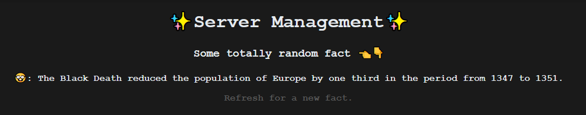

# Trabalho de Gerencimanto de Servidores - Sistemas Digitais

> Implemente um SD em uma linguagem de sua escolha, e que faça uso de uma das técnicas de passagem de mensagens estudadas na disciplina. O requisito a ser atendido, é que dadas duas ou mais máquinas do SD, se aquela que estiver atendendo requisições cair, a outra deve assumir o controle e o sistema continuar funcionando.

## Requisitos

Para a execução deste trabalho é necessário ter instalado em sua máquina:

- [NojeJS](https://nodejs.org/en/)
- [NPM](https://www.npmjs.com/)

## Instalação e execução

Após clonar o repositório, execute o comando abaixo para instalar as dependências do projeto:

`npm install`

Para a execução do projeto, execute o comando abaixo:

`npm start`

O projeto será executado no `localhost:3000`, onde aparecerá a seguinte imagem:

Este projeto foi desenvolvido com o consumo da API [Random Facts](https://uselessfacts.jsph.pl), que retorna fatos aleatórios.

## Gerenciamento

O gerenciamento em si foi feito utilizando a biblioteca Cluster do NodeJS, que permite a criação de processos filhos, que são responsáveis por executar o código do projeto. O Cluster também permite a criação de um processo mestre, que é responsável por gerenciar os processos filhos. O processo é executado na pasta `index.js`, onde é gerado um processo pai que cria workes (clusters), com o método `cluster.fork()`.

O processo pai fica responsável por monitorar os processos filhos, e caso algum deles caia, ele cria um novo processo filho para substituí-lo, a partir do método `cluster.on`, no caso executamos um `setTimeOut` que manda uma mensagem para o cluster matando o processo atual, e assim criando um novo filho para continuar sua execução. Este trigger foi feito para que as requisições do trabalho fossem cumpridas. Todo cluster filho executa o bloco de código `else`, que executa o sercidor, sendo assim, a porta `localhost:3000` é executada por todos os processos filhos.

As informações da porta e do processo filho são exibidas no console, para que seja possível verificar o funcionamento do gerenciamento.
